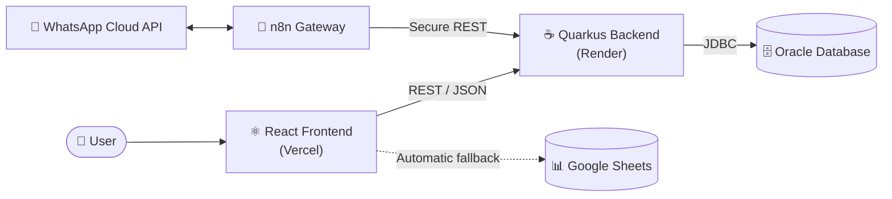

<div align="center">

# 🦷 StartUpados() — Turma do Bem Platform

**A full-stack system that digitizes and manages operations for the NGO [Turma do Bem](https://www.turmadobem.org.br/)** — integrating an institutional website, patient and volunteer portals, an executive dashboard, WhatsApp messaging, and a _Machine Learning_ model for patient prioritization.

[](https://react.dev/)
[](https://www.typescriptlang.org/)
[](https://vitejs.dev/)
[](https://tailwindcss.com/)
[](https://openjdk.org/)
[](https://quarkus.io/)
[](https://www.oracle.com/database/)

### 🔗 Project Links

[**🌐 Live App**](https://www.startupados.com.br/) &nbsp;•&nbsp; [**📺 Demo (YouTube)**](https://www.youtube.com/watch?v=wU_QVad8MSQ) &nbsp;•&nbsp; [**💻 Repository**](https://github.com/Start-Upados/Front_TdB)

🇧🇷 _[Versão em Português](README.md)_

</div>

---

## 📑 Table of Contents

- [About the Project](#-about-the-project)
- [Architecture](#-architecture)
- [Tech Stack](#-tech-stack)
- [Features](#-features)
- [Machine Learning](#-machine-learning--patient-prioritization)
- [Routing Structure](#-routing-structure)
- [Project Structure](#-project-structure)
- [Integrations & Endpoints](#-integrations--endpoints)
- [Security & Best Practices](#-security--best-practices)
- [Environment Variables](#-environment-variables)
- [Running Locally](#-running-locally)
- [Deployment](#-deployment)
- [Roadmap](#-roadmap)
- [Team](#-team)
- [License](#-license)

---

## 🎯 About the Project

**Turma do Bem** is a Brazilian NGO that provides free dental care to two vulnerable groups:

- **Dentista do Bem** — at-risk youth aged 11 to 17
- **Apolônias do Bem** — women survivors of violence with dental damage

The **StartUpados()** platform was built to digitize and streamline the NGO's processes end to end, delivering:

- An accessible institutional website with information about both programs
- A public portal for online care requests
- A beneficiary portal for treatment tracking
- A volunteer dentist panel
- An executive dashboard with real-time indicators
- Patient validation via **QR Code**
- Registration flows for volunteers, employees, and outreach campaigns
- Integration with an **Oracle** database through a **Java/Quarkus** backend
- **WhatsApp Cloud API** messaging integration (in progress)
- A **Machine Learning** model for intelligent care prioritization

> The system was designed with a **backend-first** philosophy: Quarkus owns all business logic and Oracle is the single source of truth, while **Google Sheets** acts as an automatic _fallback_ layer to guarantee resilience even when the backend is unavailable.

---

## 🏛 Architecture



**Architectural principles:**

| Principle | Implementation |
|---|---|
| **Separation of concerns** | Frontend (UI/UX) ↔ Backend (business logic) ↔ Database (persistence) |
| **Single source of truth** | Oracle Database, accessed exclusively by Quarkus |
| **Resilience** | Fallback to Google Sheets when the backend hibernates or fails |
| **Stateless gateway** | n8n never touches the database — it always calls Quarkus REST endpoints |
| **Hydration pattern** | `persistir()` / `hidratar()` in _localStorage_ + `carregar...Reais()` that fetches from Oracle and merges with local state |

---

## 🛠 Tech Stack

### Frontend

| Technology | Version | Usage |
|---|---|---|
| React | 19 | Core framework |
| TypeScript | 5+ | Static typing |
| Vite | 6+ | Build tool and dev server |
| Tailwind CSS | v4 | Utility-first styling |
| React Router DOM | v7 | Routing and protected routes |
| React Hook Form | — | Form management and validation |
| Recharts | — | Dashboard charts |
| qrcode.react | — | QR Code generation |
| jsPDF | — | PDF report export |

### Backend

| Technology | Usage |
|---|---|
| Java 21 | Language |
| Quarkus | Framework |
| Jakarta REST (JAX-RS) | REST API |
| JDBC | Database connection |
| Oracle Database | Relational database |

### Integrations & Infrastructure

| Service | Usage |
|---|---|
| Vercel | Frontend hosting (automatic CI/CD) |
| Render.com | Java backend hosting |
| Google Sheets | Secondary storage / fallback |
| Google Apps Script | Intermediary API for Sheets |
| WhatsApp Cloud API | Messaging channel (in progress) |
| n8n Cloud | Messaging workflow orchestration |
| VLibras | Brazilian Sign Language accessibility |

### Machine Learning

| Technology | Usage |
|---|---|
| Python | Language |
| Pandas | Data manipulation |
| Scikit-learn | Classification model |
| Seaborn / Matplotlib | Exploratory visualizations |

---

## ✨ Features

### 🏠 Institutional Website
- Home page with carousel and informational sections
- Pages: Services, About, Team, FAQ, Contact
- Full accessibility via **VLibras**
- **Fully responsive** design (mobile, tablet, and desktop)

### 📝 Care Request
- Choice between **Dentista do Bem** (youth 11–17) and **Apolônias do Bem** (women)
- **3-step** form for youth (teen data, guardian, care details)
- **2-step** form for women (personal data, care details)
- **Automatic input masks** for CPF (`000.000.000-00`) and CEP (`00000-000`) in real time
- Integrated **age validation**: 11–17 for youth, 18+ for women
- Automatic generation of a **unique protocol** (`TDB-2026-XXXX` / `APO-2026-XXXX`)
- Automatic generation of an **access password** and a **unique QR Code** per patient
- Persistence to **Oracle** with a Google Sheets _backup_

### 🔐 Beneficiary Portal
- Login by CPF and password
- Appointment history and treatment progress
- Upcoming appointments
- 30-minute _session timeout_ with advance warning
- Backend lookup with mock _fallback_

### 📷 Patient Validation (QR Code)
- Access by scanning a **QR Code** or entering the protocol manually
- Full patient record display
- Appointment history on a _timeline_
- Attendance confirmation recorded in the system

### 🦷 Dentist Panel
- Login by CRO (dental license) and password
- Upcoming appointments agenda
- Quick access to QR Code patient validation
- 30-minute _session timeout_

### 🤝 Volunteer (Dentist) Registration
- **3-step** form (personal, professional, and practice data)
- Automatic protocol `VOL-2026-XXXX` and generated password
- Java backend integration with a Google Sheets _backup_

### 📊 Executive Dashboard (Admin)
A protected admin panel organized into modules:

| Module | Description |
|---|---|
| **Overview** | Consolidated NGO KPIs (patients in treatment, donations, monthly appointments) — all dynamic |
| **Operations / Appointments** | Agenda and full appointment lifecycle (confirm, start, finish, cancel, reschedule) |
| **Triage** | Patient queue with dentist invitations, average wait time, and 60+ day queue alerts |
| **Volunteers** | Dentist network and engagement |
| **Social Impact** | Beneficiary profile and impact generated |
| **Geography** | National distribution and regional coverage |
| **Financial** | Donations, partners, and financial indicators |
| **Reports** | PDF export segmented by audience (donor, partner, SDG/ESG, internal) |
| **Message Center** | Real-time hub of all care requests |
| **Data Entry** | Manual record insertion |
| **Register Employee** | Employee registration with generated password |
| **Manage Campaigns** | Registration and tracking of dental outreach campaigns |

**Cross-cutting dashboard features:**
- 🌙 **Scoped dark mode** — applied conditionally only on dashboard routes
- 📄 **PDF export** across multiple pages
- 📈 **Dynamic KPIs** computed from real Oracle data

### 💬 Message Center
- Reads from the Java backend (`GET /solicitacao`) as the primary source, with a Google Sheets _fallback_
- Filters by type (Beneficiary, Volunteer, Donor, Partner)
- Search by name, email, or message
- **Automatic status transitions** based on the message sender
- Internal notes per request

### 📱 WhatsApp Integration _(in progress)_
Integration with the **WhatsApp Cloud API** orchestrated via **n8n**, following a stateless _gateway_ architecture (Quarkus controls the logic, n8n only delivers):

| Phase | Scope | Status |
|---|---|---|
| **Phase 1** | Inbound patient messages with WAMID deduplication | ✅ Working |
| **Phase 2** | Appointment reminders via Meta-approved _templates_ | 🔧 In progress |
| **Phase 3** | Attendance confirmation with interactive buttons | 🔧 In progress |
| **Phase 4** | Bulk broadcast | 📋 Planned |

> Button payload convention: `action:type:id` (e.g., `confirmar:consulta:1023`), enabling a generic action router on the backend.

---

## 🤖 Machine Learning — Patient Prioritization

A classification model that automatically prioritizes care requests into three levels — **HIGH**, **MEDIUM**, and **LOW** — helping the NGO allocate resources where impact is greatest.

### Dataset

- **Records:** 2,638 (after removing 9 duplicates)
- **Features:** `tipo_pedido`, `sexo`, `idade`, `tempo_espera`, `vulnerabilidade`, `tipo_violencia`, `elegivel`, `programa`, `dano_dentario`, `tipo_tratamento`

| Priority | Count | % |
|---|---|---|
| LOW | 1,151 | 44% |
| MEDIUM | 937 | 35% |
| HIGH | 550 | 21% |

### Prioritization Logic

**Apolônias do Bem (women):**
- `HIGH` → severe damage + severe violence
- `HIGH` → severe damage + age ≥ 50
- `HIGH` → moderate damage + severe violence + age ≥ 45

**Dentista do Bem (youth 11–17):**
- `HIGH` → high vulnerability + root canal or extraction
- `HIGH` → high vulnerability + restoration + wait time > 20 days

### Model

```python
RandomForestClassifier(
    n_estimators=200,
    max_depth=15,
    min_samples_split=5,
    class_weight='balanced',
    random_state=42
)
```

> The model is trained reproducibly and packaged to serve priority predictions for requests received through the platform.

---

## 🗺 Routing Structure

```
/                        → Home (institutional website)
/NossosServicos          → Services
/SobreNos                → About
/Integrantes             → Team
/FAQ                     → Frequently Asked Questions
/FaleConosco             → Contact
/login                   → Login (4 profiles + donation)
/solicitar-atendimento   → Care request
/validar-paciente        → QR Code / protocol validation
/meu-atendimento         → Beneficiary Portal          🔒 protected
/meu-painel              → Dentist Panel                🔒 protected
/cadastrar-voluntario    → Volunteer dentist registration
/dashboard               → Executive Dashboard          🔒 protected (admin)
*                        → 404 Not Found
```

---

## 📂 Project Structure

```
src/
├── Components/
│   ├── Header/
│   ├── Footer/
│   ├── Layout/
│   ├── HeroCarousel/
│   ├── HomeSections/
│   ├── ProtectedRoute/
│   │   ├── ProtectedRoute.tsx
│   │   ├── ProtectedRoutePaciente.tsx
│   │   └── ProtectedRouteDentista.tsx
│   └── SessionWarning/
├── Pages/
│   ├── Home/
│   ├── Login/
│   ├── Dashboard/
│   │   ├── Dashboard.tsx
│   │   └── pages/
│   │       ├── OverviewPage.tsx
│   │       ├── OperationsPage.tsx
│   │       ├── TriagensPage.tsx
│   │       ├── VolunteersPage.tsx
│   │       ├── SocialImpactPage.tsx
│   │       ├── GeographyPage.tsx
│   │       ├── FinancialPage.tsx
│   │       ├── RelatoriosPage.tsx
│   │       ├── DataEntryPage.tsx
│   │       ├── MessagesPage.tsx
│   │       ├── CadastrarFuncionario.tsx
│   │       └── GerenciarMutiroes.tsx
│   ├── PortalBeneficiario/
│   ├── PainelDentista/
│   ├── SolicitarAtendimento/
│   ├── ValidarPaciente/
│   ├── CadastrarVoluntario/
│   ├── NotFound/
│   ├── FAQ/  FaleConosco/  Integrantes/  NossosServicos/  SobreNos/
├── Services/
│   ├── api.ts              # Java backend integration
│   └── googleSheets.ts     # Google Sheets integration (fallback)
└── Hooks/
    └── useSessionTimeout.ts
```

---

## 🔌 Integrations & Endpoints

### Java Backend — Main Endpoints

| Method | Endpoint | Description |
|---|---|---|
| `POST` | `/solicitacao` | Create a care request |
| `GET` | `/solicitacao` | List all care requests |
| `GET` | `/solicitacao/{rgCpf}` | Find a request by CPF |
| `POST` | `/beneficiario` | Register a beneficiary (patient login) |
| `GET` | `/beneficiario/{rgCpf}` | Find a beneficiary |
| `POST` | `/dentista` | Register a volunteer dentist |
| `PUT` | `/dentista/{rgCpf}/addAtendimento` | Record a dentist appointment |
| `POST` | `/funcionario` | Register an employee |
| `PUT` | `/funcionario/{rgCpf}` | Update an employee |
| `POST` | `/campanha` | Register an outreach campaign |
| `PUT` | `/campanha/{nome}/addAtendimento` | Add appointments to a campaign |

### Google Sheets — Fallback Layer

The `Turma_Do_Bem` spreadsheet, with tabs populated according to the record's origin:

| Tab | Populated by |
|---|---|
| Mensagens | Care Request |
| Pacientes | Care Request |
| Voluntarios | Volunteer Registration |
| Funcionarios | Employee Registration |
| Mutiroes | Campaign Management |
| Atendimentos | Patient Validation |

---

## 🔒 Security & Best Practices

Security was treated as a first-class requirement throughout this project:

- ✅ **No credentials in the repository** — all keys and secrets live in environment variables, outside version control (`.gitignore`)
- ✅ **Restricted CORS** — the backend only accepts requests from the official frontend origin
- ✅ **Protected routes** on the frontend by user profile (beneficiary, dentist, admin)
- ✅ **Session timeout** of 30 minutes on authenticated portals
- ✅ **Stateless messaging gateway** — n8n never accesses the database directly; every write goes through authenticated Quarkus REST endpoints (internal Bearer token)
- ✅ **Input normalization and validation** — masks and validation for CPF, CEP, age, and data format before persistence

> ⚠️ Demo credentials are available **on request** and are not versioned in this repository.

---

## 🔧 Environment Variables

Create a `.env` file at the project root from the template below. **Never commit real values** — use `.env.example` as a reference.

```env
# Java backend (Quarkus) URL
VITE_API_URL=https://<your-backend>.onrender.com

# Google Sheets integration (fallback)
VITE_GOOGLE_SHEET_ID=<your-spreadsheet-id>
VITE_GOOGLE_CLIENT_EMAIL=<your-service-account>@<project>.iam.gserviceaccount.com
VITE_GOOGLE_PRIVATE_KEY="<your-private-key>"
```

---

## ▶️ Running Locally

**Prerequisites:** Node.js 18+ and npm.

```bash
# 1. Clone the repository
git clone https://github.com/Start-Upados/Front_TdB.git
cd Front_TdB

# 2. Install dependencies
npm install

# 3. Configure environment variables
cp .env.example .env   # then fill in the values

# 4. Run in development mode
npm run dev

# 5. Production build
npm run build
npm run preview
```

> 💡 **Tip:** if you see `Failed to fetch dynamically imported module`, clear the Vite cache with `rm -rf node_modules/.vite` and restart `npm run dev`.

---

## 🚀 Deployment

| Layer | Platform | Notes |
|---|---|---|
| **Frontend** | Vercel | Automatic deploy on every `push` to the `main` branch |
| **Backend** | Render.com | Hibernates after 15 min of inactivity |

> ⚠️ **Cold start:** on Render's free tier the backend hibernates after inactivity — the first request may take up to ~60s to wake the service. The frontend handles this with an automatic _fallback_ to Google Sheets, keeping the app functional.

**Production environment:** [www.startupados.com.br](https://www.startupados.com.br/)

---

## 🔜 Roadmap

- [x] Java + Quarkus backend with Oracle DB
- [x] Frontend → Backend connection via REST API
- [x] Beneficiary login persistence (dedicated table)
- [x] Input masks and validation (CPF, CEP, age)
- [x] Full appointment and triage lifecycle
- [x] PDF report export
- [x] WhatsApp Cloud API — Phase 1 (inbound)
- [ ] WhatsApp Cloud API — Phases 2 and 3 (reminders and confirmation)
- [ ] Robust JWT authentication
- [ ] Serve the ML model as a REST API integrated into the platform
- [ ] Meta Graph API (Instagram and Facebook) in the Message Center

---

## 👥 Team

Built by the **StartUpados()** group — FIAP 2026.

| Name | Responsibility | LinkedIn |
|---|---|---|
| **Pedro Henrique Falchi** | Frontend & Integrations | [LinkedIn](https://www.linkedin.com/in/pedro-henrique-falchi-4ab4b937b) |
| **Matheus Guimarães** | Backend & Database | [LinkedIn](https://www.linkedin.com/in/matheus-guimar%C3%A3es-rosa-04522435b/) |

📧 **Contact:** startupados@gmail.com

---

## 📄 License

This project is licensed under the **MIT License** — see the [`LICENSE`](LICENSE) file for details.

---

<div align="center">

**Built by StartUpados() for Turma do Bem**

_Transforming smiles, transforming lives._ 🦷✨

</div>
