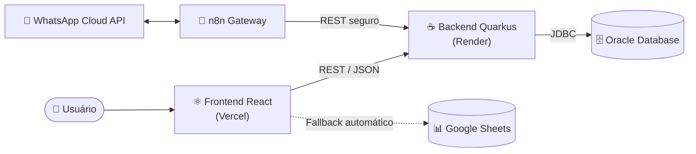

<div align="center">

# 🦷 StartUpados() — Plataforma Turma do Bem

**Sistema full-stack para digitalização e gestão da ONG [Turma do Bem](https://www.turmadobem.org.br/)** — integrando site institucional, portais de atendimento, dashboard executivo, integração via WhatsApp e um modelo de _Machine Learning_ para priorização de pacientes.

[](https://react.dev/)
[](https://www.typescriptlang.org/)
[](https://vitejs.dev/)
[](https://tailwindcss.com/)
[](https://openjdk.org/)
[](https://quarkus.io/)
[](https://www.oracle.com/database/)

### 🔗 Acesso ao Projeto

[**🌐 Aplicação ao vivo**](https://www.startupados.com.br/) &nbsp;•&nbsp; [**📺 Demonstração (YouTube)**](https://www.youtube.com/watch?v=wU_QVad8MSQ) &nbsp;•&nbsp; [**💻 Repositório**](https://github.com/Start-Upados/Front_TdB)

</div>

---

## 📑 Sumário

- [Sobre o Projeto](#-sobre-o-projeto)
- [Arquitetura](#-arquitetura)
- [Stack Tecnológica](#-stack-tecnológica)
- [Funcionalidades](#-funcionalidades)
- [Machine Learning](#-machine-learning--priorização-de-atendimentos)
- [Estrutura de Rotas](#-estrutura-de-rotas)
- [Estrutura de Arquivos](#-estrutura-de-arquivos)
- [Integrações & Endpoints](#-integrações--endpoints)
- [Segurança & Boas Práticas](#-segurança--boas-práticas)
- [Variáveis de Ambiente](#-variáveis-de-ambiente)
- [Como Rodar Localmente](#-como-rodar-localmente)
- [Deploy](#-deploy)
- [Roadmap](#-roadmap)
- [Equipe](#-equipe)
- [Licença](#-licença)

---

## 🎯 Sobre o Projeto

A **Turma do Bem** é uma ONG que oferece tratamento odontológico gratuito para dois públicos em situação de vulnerabilidade:

- **Dentista do Bem** — jovens de 11 a 17 anos em vulnerabilidade social
- **Apolônias do Bem** — mulheres vítimas de violência com a dentição afetada

A plataforma **StartUpados()** foi desenvolvida para digitalizar e otimizar os processos da ONG de ponta a ponta, oferecendo:

- Site institucional acessível com informações sobre os programas
- Portal público para solicitação de atendimento online
- Portal do beneficiário para acompanhamento do tratamento
- Painel do dentista voluntário
- Dashboard executivo com indicadores em tempo real
- Validação de pacientes por **QR Code**
- Cadastro de voluntários, funcionários e mutirões
- Integração com banco de dados **Oracle** via backend **Java/Quarkus**
- Integração de mensageria via **WhatsApp Cloud API** (em desenvolvimento)
- Modelo de **Machine Learning** para priorização inteligente de atendimentos

> O sistema foi desenhado com uma filosofia **backend-first**: o Quarkus concentra toda a regra de negócio e o Oracle é a fonte única da verdade, com o **Google Sheets** atuando como camada de _fallback_ automático para garantir resiliência mesmo se o backend estiver indisponível.

---

## 🏛 Arquitetura



**Princípios de arquitetura:**

| Princípio | Implementação |
|---|---|
| **Separação de responsabilidades** | Frontend (UI/UX) ↔ Backend (regra de negócio) ↔ Banco (persistência) |
| **Fonte única da verdade** | Oracle Database, acessado exclusivamente pelo Quarkus |
| **Resiliência** | _Fallback_ para Google Sheets quando o backend hiberna ou falha |
| **Gateway stateless** | n8n nunca toca o banco — sempre chama endpoints REST do Quarkus |
| **Padrão de hidratação** | `persistir()` / `hidratar()` em _localStorage_ + `carregar...Reais()` que busca do Oracle e mescla com o estado local |

---

## 🛠 Stack Tecnológica

### Frontend

| Tecnologia | Versão | Uso |
|---|---|---|
| React | 19 | Framework principal |
| TypeScript | 5+ | Tipagem estática |
| Vite | 6+ | Build tool e dev server |
| Tailwind CSS | v4 | Estilização utilitária |
| React Router DOM | v7 | Roteamento e rotas protegidas |
| React Hook Form | — | Gerenciamento e validação de formulários |
| Recharts | — | Gráficos do dashboard |
| qrcode.react | — | Geração de QR Code |
| jsPDF | — | Exportação de relatórios em PDF |

### Backend

| Tecnologia | Uso |
|---|---|
| Java 21 | Linguagem |
| Quarkus | Framework |
| Jakarta REST (JAX-RS) | API REST |
| JDBC | Conexão com banco |
| Oracle Database | Banco de dados relacional |

### Integrações & Infraestrutura

| Serviço | Uso |
|---|---|
| Vercel | Deploy do frontend (CI/CD automático) |
| Render.com | Hospedagem do backend Java |
| Google Sheets | Armazenamento secundário / _fallback_ |
| Google Apps Script | API intermediária para o Sheets |
| WhatsApp Cloud API | Canal de mensageria (em desenvolvimento) |
| n8n Cloud | Orquestração de workflows de mensageria |
| VLibras | Acessibilidade em Libras |

### Machine Learning

| Tecnologia | Uso |
|---|---|
| Python | Linguagem |
| Pandas | Manipulação de dados |
| Scikit-learn | Modelo de classificação |
| Seaborn / Matplotlib | Visualizações exploratórias |

---

## ✨ Funcionalidades

### 🏠 Site Institucional
- Home com carrossel e seções informativas
- Páginas: Nossos Serviços, Sobre Nós, Integrantes, FAQ, Fale Conosco
- Acessibilidade completa com **VLibras**
- Design **totalmente responsivo** (mobile, tablet e desktop)

### 📝 Solicitação de Atendimento
- Seleção entre **Dentista do Bem** (jovens 11–17) e **Apolônias do Bem** (mulheres)
- Formulário em **3 etapas** para jovens (dados do adolescente, responsável, atendimento)
- Formulário em **2 etapas** para mulheres (dados pessoais, atendimento)
- **Máscaras automáticas** de CPF (`000.000.000-00`) e CEP (`00000-000`) em tempo real
- **Validação de idade** integrada: 11–17 anos para jovens, 18+ para mulheres
- Geração automática de **protocolo único** (`TDB-2026-XXXX` / `APO-2026-XXXX`)
- Geração automática de **senha de acesso** e **QR Code único** por paciente
- Persistência em **Oracle** com _backup_ em Google Sheets

### 🔐 Portal do Beneficiário
- Login por CPF e senha
- Histórico de consultas e progresso do tratamento
- Próximos atendimentos
- _Session timeout_ de 30 minutos com aviso prévio
- Busca no backend Java com _fallback_ para mock

### 📷 Validação de Paciente (QR Code)
- Acesso por leitura de **QR Code** ou digitação manual do protocolo
- Exibição da ficha completa do paciente
- Histórico de atendimentos em _timeline_
- Confirmação de atendimento registrada no sistema

### 🦷 Painel do Dentista
- Login por CRO e senha
- Agenda de próximos atendimentos
- Acesso rápido à validação de paciente por QR Code
- _Session timeout_ de 30 minutos

### 🤝 Cadastro de Voluntário (Dentista)
- Formulário em **3 etapas** (dados pessoais, profissionais, atuação)
- Protocolo automático `VOL-2026-XXXX` e senha gerada
- Integração com backend Java + _backup_ em Google Sheets

### 📊 Dashboard Executivo (Admin)
Painel administrativo com acesso protegido, organizado em módulos:

| Módulo | Descrição |
|---|---|
| **Visão Geral** | KPIs consolidados da ONG (pacientes em tratamento, doações, atendimentos no mês) — todos dinâmicos |
| **Operação / Atendimentos** | Agenda e ciclo de vida completo dos atendimentos (confirmar, iniciar, finalizar, cancelar, reagendar) |
| **Triagens** | Fila de pacientes com convites a dentistas, tempo médio de espera e alertas de fila +60 dias |
| **Voluntários** | Rede de dentistas e engajamento |
| **Impacto Social** | Perfil dos beneficiários e transformação gerada |
| **Geografia** | Distribuição nacional e cobertura por região |
| **Financeiro** | Doações, parceiros e indicadores financeiros |
| **Relatórios** | Exportação em PDF segmentada por público (doador, parceiro, ODS/ESG, interno) |
| **Central de Mensagens** | Hub de todas as solicitações em tempo real |
| **Inserir Dados** | Adição manual de registros |
| **Cadastrar Funcionário** | Registro de funcionários com senha gerada |
| **Gerenciar Mutirões** | Cadastro e acompanhamento de mutirões de atendimento |

**Recursos transversais do dashboard:**
- 🌙 **Dark mode com escopo** — aplicado condicionalmente apenas nas rotas do dashboard
- 📄 **Exportação PDF** em múltiplas páginas
- 📈 **KPIs dinâmicos** calculados a partir dos dados reais do Oracle

### 💬 Central de Mensagens
- Leitura do backend Java (`GET /solicitacao`) como fonte primária, com _fallback_ para Google Sheets
- Filtros por tipo (Beneficiário, Voluntário, Doador, Parceiro)
- Busca por nome, e-mail ou mensagem
- **Transições de status automáticas** com base no remetente da mensagem
- Notas internas por solicitação

### 📱 Integração WhatsApp _(em desenvolvimento)_
Integração com a **WhatsApp Cloud API** orquestrada via **n8n**, seguindo arquitetura de _gateway_ stateless (o Quarkus controla a lógica, o n8n apenas entrega):

| Fase | Escopo | Status |
|---|---|---|
| **Fase 1** | Recebimento de mensagens de pacientes (_inbound_) com deduplicação por WAMID | ✅ Funcional |
| **Fase 2** | Lembretes de consulta via _templates_ aprovados pela Meta | 🔧 Em construção |
| **Fase 3** | Confirmação de presença com botões interativos | 🔧 Em construção |
| **Fase 4** | Disparo em massa / _broadcast_ | 📋 Planejado |

> Convenção de payload de botões: `acao:tipo:id` (ex.: `confirmar:consulta:1023`), permitindo um roteador genérico de ações no backend.

---

## 🤖 Machine Learning — Priorização de Atendimentos

Modelo de classificação que prioriza automaticamente as solicitações de atendimento em três níveis — **ALTA**, **MÉDIA** e **BAIXA** — ajudando a ONG a alocar recursos onde o impacto é maior.

### Dataset

- **Registros:** 2.638 (após remoção de 9 duplicatas)
- **Features:** `tipo_pedido`, `sexo`, `idade`, `tempo_espera`, `vulnerabilidade`, `tipo_violencia`, `elegivel`, `programa`, `dano_dentario`, `tipo_tratamento`

| Prioridade | Quantidade | % |
|---|---|---|
| BAIXA | 1.151 | 44% |
| MÉDIA | 937 | 35% |
| ALTA | 550 | 21% |

### Lógica de Priorização

**Apolônias do Bem (mulheres):**
- `ALTA` → dano grave + violência grave
- `ALTA` → dano grave + idade ≥ 50
- `ALTA` → dano moderado + violência grave + idade ≥ 45

**Dentista do Bem (jovens 11–17):**
- `ALTA` → vulnerabilidade alta + tratamento de canal ou extração
- `ALTA` → vulnerabilidade alta + restauração + tempo de espera > 20 dias

### Modelo

```python
RandomForestClassifier(
    n_estimators=200,
    max_depth=15,
    min_samples_split=5,
    class_weight='balanced',
    random_state=42
)
```

> O modelo é treinado de forma reproduzível e empacotado para servir previsões de prioridade às solicitações recebidas pela plataforma.

---

## 🗺 Estrutura de Rotas

```
/                        → Home (site institucional)
/NossosServicos          → Nossos Serviços
/SobreNos                → Sobre Nós
/Integrantes             → Integrantes
/FAQ                     → Perguntas Frequentes
/FaleConosco             → Fale Conosco
/login                   → Login (4 perfis + doação)
/solicitar-atendimento   → Solicitação de atendimento
/validar-paciente        → Validação por QR Code ou protocolo
/meu-atendimento         → Portal do Beneficiário      🔒 protegido
/meu-painel              → Painel do Dentista           🔒 protegido
/cadastrar-voluntario    → Cadastro de dentista voluntário
/dashboard               → Dashboard Executivo          🔒 protegido (admin)
*                        → 404 Not Found
```

---

## 📂 Estrutura de Arquivos

```
src/
├── Components/
│   ├── Header/
│   ├── Footer/
│   ├── Layout/
│   ├── HeroCarousel/
│   ├── HomeSections/
│   ├── ProtectedRoute/
│   │   ├── ProtectedRoute.tsx
│   │   ├── ProtectedRoutePaciente.tsx
│   │   └── ProtectedRouteDentista.tsx
│   └── SessionWarning/
├── Pages/
│   ├── Home/
│   ├── Login/
│   ├── Dashboard/
│   │   ├── Dashboard.tsx
│   │   └── pages/
│   │       ├── OverviewPage.tsx
│   │       ├── OperationsPage.tsx
│   │       ├── TriagensPage.tsx
│   │       ├── VolunteersPage.tsx
│   │       ├── SocialImpactPage.tsx
│   │       ├── GeographyPage.tsx
│   │       ├── FinancialPage.tsx
│   │       ├── RelatoriosPage.tsx
│   │       ├── DataEntryPage.tsx
│   │       ├── MessagesPage.tsx
│   │       ├── CadastrarFuncionario.tsx
│   │       └── GerenciarMutiroes.tsx
│   ├── PortalBeneficiario/
│   ├── PainelDentista/
│   ├── SolicitarAtendimento/
│   ├── ValidarPaciente/
│   ├── CadastrarVoluntario/
│   ├── NotFound/
│   ├── FAQ/  FaleConosco/  Integrantes/  NossosServicos/  SobreNos/
├── Services/
│   ├── api.ts              # Integração backend Java
│   └── googleSheets.ts     # Integração Google Sheets (fallback)
└── Hooks/
    └── useSessionTimeout.ts
```

---

## 🔌 Integrações & Endpoints

### Backend Java — Principais Endpoints

| Método | Endpoint | Descrição |
|---|---|---|
| `POST` | `/solicitacao` | Cadastrar solicitação de atendimento |
| `GET` | `/solicitacao` | Listar todas as solicitações |
| `GET` | `/solicitacao/{rgCpf}` | Buscar solicitação por CPF |
| `POST` | `/beneficiario` | Cadastrar beneficiário (login do paciente) |
| `GET` | `/beneficiario/{rgCpf}` | Buscar beneficiário |
| `POST` | `/dentista` | Cadastrar dentista voluntário |
| `PUT` | `/dentista/{rgCpf}/addAtendimento` | Registrar atendimento do dentista |
| `POST` | `/funcionario` | Cadastrar funcionário |
| `PUT` | `/funcionario/{rgCpf}` | Atualizar funcionário |
| `POST` | `/campanha` | Cadastrar mutirão |
| `PUT` | `/campanha/{nome}/addAtendimento` | Adicionar atendimentos ao mutirão |

### Google Sheets — Camada de _Fallback_

Planilha `Turma_Do_Bem`, com abas alimentadas conforme a origem do registro:

| Aba | Alimentada por |
|---|---|
| Mensagens | Solicitar Atendimento |
| Pacientes | Solicitar Atendimento |
| Voluntarios | Cadastrar Voluntário |
| Funcionarios | Cadastrar Funcionário |
| Mutiroes | Gerenciar Mutirões |
| Atendimentos | Validar Paciente |

---

## 🔒 Segurança & Boas Práticas

A segurança foi tratada como requisito de primeira classe neste projeto:

- ✅ **Nenhuma credencial no repositório** — todas as chaves e segredos ficam em variáveis de ambiente, fora do controle de versão (`.gitignore`)
- ✅ **CORS restrito** — o backend libera requisições apenas da origem oficial do frontend
- ✅ **Rotas protegidas** no frontend por perfil de usuário (beneficiário, dentista, admin)
- ✅ **_Session timeout_** de 30 minutos nos portais autenticados
- ✅ **Gateway de mensageria stateless** — o n8n nunca acessa o banco diretamente; toda escrita passa por endpoints REST autenticados do Quarkus (Bearer token interno)
- ✅ **Normalização e validação de entrada** — máscaras e validação de CPF, CEP, idade e formato de dados antes da persistência

> ⚠️ As credenciais de demonstração estão disponíveis **sob solicitação** e não são versionadas neste repositório.

---

## 🔧 Variáveis de Ambiente

Crie um arquivo `.env` na raiz do projeto a partir do modelo abaixo. **Nunca commite valores reais** — utilize o `.env.example` como referência.

```env
# URL do backend Java (Quarkus)
VITE_API_URL=https://<seu-backend>.onrender.com

# Integração Google Sheets (fallback)
VITE_GOOGLE_SHEET_ID=<id-da-sua-planilha>
VITE_GOOGLE_CLIENT_EMAIL=<sua-service-account>@<projeto>.iam.gserviceaccount.com
VITE_GOOGLE_PRIVATE_KEY="<sua-chave-privada>"
```

---

## ▶️ Como Rodar Localmente

**Pré-requisitos:** Node.js 18+ e npm.

```bash
# 1. Clonar o repositório
git clone https://github.com/Start-Upados/Front_TdB.git
cd Front_TdB

# 2. Instalar dependências
npm install

# 3. Configurar variáveis de ambiente
cp .env.example .env   # e preencha os valores

# 4. Rodar em modo desenvolvimento
npm run dev

# 5. Build de produção
npm run build
npm run preview
```

> 💡 **Dica:** se aparecer `Failed to fetch dynamically imported module`, limpe o cache do Vite com `rm -rf node_modules/.vite` e reinicie o `npm run dev`.

---

## 🚀 Deploy

| Camada | Plataforma | Observações |
|---|---|---|
| **Frontend** | Vercel | Deploy automático a cada `push` na branch `main` |
| **Backend** | Render.com | Hiberna após 15 min de inatividade |

> ⚠️ **Cold start:** o backend no plano gratuito do Render hiberna após inatividade — a primeira requisição pode levar até ~60s para "acordar" o serviço. O frontend trata esse cenário com _fallback_ automático para o Google Sheets, garantindo que a aplicação continue funcional.

**Ambiente de produção:** [www.startupados.com.br](https://www.startupados.com.br/)

---

## 🔜 Roadmap

- [x] Backend Java + Quarkus com Oracle DB
- [x] Conexão Frontend → Backend via REST API
- [x] Persistência de login do beneficiário (tabela dedicada)
- [x] Máscaras e validações de entrada (CPF, CEP, idade)
- [x] Ciclo de vida completo de atendimentos e triagens
- [x] Exportação de relatórios em PDF
- [x] WhatsApp Cloud API — Fase 1 (_inbound_)
- [ ] WhatsApp Cloud API — Fases 2 e 3 (lembretes e confirmação)
- [ ] Autenticação JWT robusta
- [ ] Servir o modelo de ML como API REST integrada à plataforma
- [ ] Meta Graph API (Instagram e Facebook) na Central de Mensagens

---

## 👥 Equipe

Desenvolvido pelo grupo **StartUpados()** — FIAP 2026.

| Nome | Responsabilidade | LinkedIn |
|---|---|---|
| **Pedro Henrique Falchi** | Frontend & Integrações | [LinkedIn](https://www.linkedin.com/in/pedro-henrique-falchi-4ab4b937b) |
| **Matheus Guimarães** | Backend & Banco de Dados | [LinkedIn](https://www.linkedin.com/in/matheus-guimar%C3%A3es-rosa-04522435b/) |

📧 **Contato:** startupados@gmail.com

---

## 📄 Licença

Este projeto está licenciado sob a **Licença MIT** — consulte o arquivo [`LICENSE`](LICENSE) para mais detalhes.

---

<div align="center">

**Desenvolvido por StartUpados() para a Turma do Bem**

_Transformando sorrisos, transformando vidas._ 🦷✨

</div>
